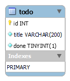

# 🔳 todos-mysql

`TODOs` - banco de dados de exemplo em MySQL.

Contém um cadastro de tarefas do tipo _TODO_.

## Como carregar

Usando o MySQL Workbench, selecione _File_, _Run Script SQL..._.


Selecione o arquivo [`scripts/todos.sql`](scripts/todos.sql).

Selecione o conjunto de caracteres `utf8` e execute clicando em _Run_.


_Se preferir, você pode usar outro cliente, como o DBeaver, por exemplo._

## Modelo de dados

Arquivo do MySQL Workbench: [`model/todos.mwb`](model/todos.mwb)

**Diagrama Entidade-Relacionamento**



### _Script_ simplificado

```sql
CREATE SCHEMA `todos` DEFAULT CHARACTER SET utf8 ;

CREATE TABLE `todos`.`todo` (
  `id` INT NOT NULL AUTO_INCREMENT,
  `title` VARCHAR(200) NOT NULL,
  `done` TINYINT(1) NOT NULL DEFAULT 0,
  PRIMARY KEY (`id`))
ENGINE = InnoDB;
```

### MySQL com Docker

```
docker run -p xxxx:3306 -e MYSQL_ROOT_PASSWORD=yyyy mysql:8.0.28
```

Substitua `xxxx` pela porta de acesso desejada, e `yyyy` pela senha desejada para o usuário `root`.

Você também pode mudar a versão do MySQL, se desejar.
